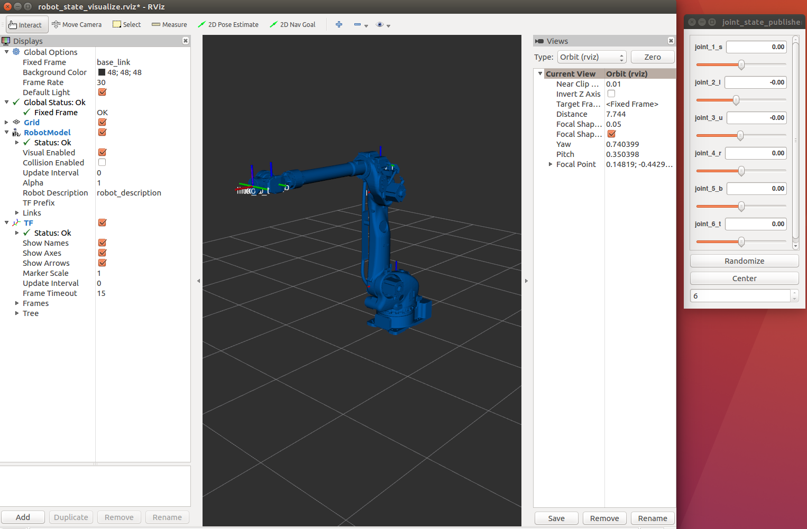

이번 포스트에서는 세계 4대 로봇 메이커중 하나인 일본의 야스카와전기(Yaskawa Electronics Corp.)사의 산업용 로봇인 MOTOMAN 을 ROS에서 사용하기 위한 인스톨 방법을 설명합니다. 다른 ROS 관련 포스트와 마찬가지로 Ubuntu 16.04 (Xenial) 의 ROS Kinetic 환경을 전제로 하고 있습니다. 

 <!-- 
If you want english post, then refer to [How to make a Docker image of ROS Kinectic on Ubuntu 16.04]().
 -->


## 개요

- [1. ROS Kinetic 인스톨과 catkin workspace 만들기](#1-ros-kinetic-인스톨과-catkin-workspace-만들기)
- [2. motoman package 빌드하기](#2-motoman-package-빌드하기)
- [3. 인스톨 내용 확인](#3-인스톨-내용-확인)
- [4. 동작 테스트](#4-동작-테스트)

<!--
- [How to install motoman package](#how-to-install-motoman-package)
	- [1. Install ROS and create a catkin workspace](#1-install-ros-and-create-a-catkin-workspace)
	- [2. Build motoman package](#2-build-motoman-package)
	- [3. Operation test](#3-operation-test)
 -->


### 1. ROS Kinetic 인스톨과 catkin workspace 만들기

<!--### 1. Install ROS and create a catkin workspace -->


ROS 의 인스톨에 관해서는 [ROS Wiki](http://wiki.ros.org/kinetic/Installation/Ubuntu)를 참조하세요.  

[ROS Wiki](http://wiki.ros.org/kinetic/Installation/Ubuntu)의 내용대로 **ROS Kinetic**을 인스톨 한 후
산업용 로봇을 사용하기 위한 **ros industrial** 패키지와 로봇의 모션 플래닝 기능을 제공하는 **moveit** 패키지를 추가로 인스톨해야 합니다.
이하를 참조하세요.

```bash
sudo apt-get install ros-kinetic-industrial-core
sudo apt-get install ros-kinetic-moveit
```

위의 인스톨이 끝난 후에 아래처럼 catkin workspace 를 만듭니다.

```bash
source /opt/ros/kinetic/setup.bash
mkdir -p [local_workspace]/catkin_ws/src
cd [local_workspace]/catkin_ws/
catkin_make
source devel/setup.bash
```

### 2. motoman package 빌드하기

<!-- ### 2. Build motoman package -->

아래 설명은 기본 git hub 의 [motoman package](https://github.com/ros-industrial/motoman)의 내용을 바탕으로 하고 있습니다.


```bash
cd [local_workspace]/catkin_ws

# 소스를 git로 다운로드. -b 뒤의 branch 명은 릴리스 버젼인 kinetic 으로 하고 싶었지만 에러가 나온 관계로
# 튜터리얼에 있는 kinetic-devel로 지정. 
git clone -b kinetic-devel https://github.com/ros-industrial/motoman.git src/motoman

# dependencies 체크하기. Note: 추가적으로 필요한 패키지가 인스톨 될 수 있음.
rosdep updat

# src 폴더 이하의 dependencies 를 고려해 필요한 패키지 인스톨 하기.
rosdep install --from-paths src/ --ignore-src --rosdistro kinetic

# workspace 빌드하기
catkin_make

# workspace 액티베이션
source devel/setup.bash
```

### 3. 인스톨 내용 확인

먼저 설치된 패키지의 내용을 확인해 보도록 하겠습니다. 아래 명령을 실행하면

```bash
tree src/motoman/ -L 1
```

아래 처럼 motoman 폴더 이하의 디렉토리들이 보입니다.
서포트 하고있는 각 로봇 기종의 폴더를 확인할 수 있습니다.

```
src/motoman/
├── CONTRIBUTING.md
├── motoman
├── motoman_driver
├── motoman_gp12_support
├── motoman_gp180_support
├── motoman_gp25_support
├── motoman_gp7_support
├── motoman_gp8_support
├── motoman_hc10_support
├── motoman_mh12_support
├── motoman_mh50_support
├── motoman_mh5_support
├── motoman_motomini_support
├── motoman_msgs
├── motoman_sda10f_moveit_config
├── motoman_sda10f_support
├── motoman_sia10d_support
├── motoman_sia10f_support
├── motoman_sia20d_moveit_config
├── motoman_sia20d_support
├── motoman_sia5d_support
└── README.md
```

한 기종을 선택하여 그 밑의 폴더의 구성을 보도록 하겠습니다. 아래 명령을 실행합니다.

```bash
tree src/motoman/motoman_gp180_support/
```

아래는 실행 결과 입니다.

```
src/motoman/motoman_gp180_support/
├── CMakeLists.txt
├── config
│   └── joint_names_gp180_120.yaml
├── launch
│   ├── load_gp180_120.launch
│   ├── robot_interface_streaming_gp180_120.launch
│   ├── robot_state_visualize_gp180_120.launch
│   └── test_gp180_120.launch
├── meshes
│   └── gp180_120
│       ├── collision
│       │   ├── base_link.stl
│       │   ├── link_1_s.stl
│       │   ├── link_2_l.stl
│       │   ├── link_3_u.stl
│       │   ├── link_4_r.stl
│       │   ├── link_5_b.stl
│       │   └── link_6_t.stl
│       └── visual
│           ├── base_link.stl
│           ├── link_1_s.stl
│           ├── link_2_l.stl
│           ├── link_3_u.stl
│           ├── link_4_r.stl
│           ├── link_5_b.stl
│           └── link_6_t.stl
├── package.xml
├── test
│   └── launch_test.xml
├── tools
│   └── process_meshes
│       ├── gp180_120
│       │   ├── input
│       │   ├── output_collision
│       │   ├── output_visual
│       │   ├── process1a-stlcmd.sh
│       │   ├── process1b-simplify.sh
│       │   ├── process2.sh
│       │   └── tmp
│       ├── meshlab_00_simplify_50p.mlx
│       ├── meshlab_01_convexhull.mlx
│       ├── meshlab_02_invert_faces.mlx
│       ├── meshlab_03_no_offset_1000t.mlx
│       ├── meshlab_03_no_offset_300t.mlx
│       ├── meshlab_03_offset_1000t.mlx
│       ├── meshlab_03_offset_300t.mlx
│       └── README.md
└── urdf
    ├── gp180_120_macro.xacro
    └── gp180_120.xacro
```

urdf 폴더의 *gp180_120_macro.xacro* 는 로봇 모델을 기술하는 파일입니다. 자세한 사항은 
[urdf 패키지](http://wiki.ros.org/ja/urdf/Tutorials)의 튜터리얼을 참조하세요.  

launch 폴더의 *load_gp180_120.launch* 는 위의 xacro 파일을 Rviz 에 로드하는 launch 파일입니다.
그리고 *test_gp180_120.launch* 는 


### 4. 동작 테스트

<!-- ### 4. Operation test  -->

간단한 동작 테스트로써 *gp180_120_macro.xacro* 를 Rviz 에 로드해보겠습니다.
launch 폴더의 *test_gp180_120.launch* 가 위 내용을 실행하면서 joint_state_publisher 노드와 robot_state_publisher 노드로
유저가 로봇 모델을 조정할 수 있도록 해줍니다.

test_gp180_120.launch:

```xml
<launch>
    <include file="$(find motoman_gp180_support)/launch/load_gp180_120.launch" />

    <param name="use_gui" value="true" />

    <node name="joint_state_publisher" pkg="joint_state_publisher" type="joint_state_publisher" />
    <node name="robot_state_publisher" pkg="robot_state_publisher" type="robot_state_publisher" />

    <node name="rviz" pkg="rviz" type="rviz" args="-d $(find industrial_robot_client)/config/robot_state_visualize.rviz" required="true" />
</launch>
```

launch 파일을 아래와 같이 실행합니다.

```bash
cd [local_workspace]/catkin_ws/
roslaunch motoman_gp180_support test_gp180_120.launch
```

실행 결과로 아래와 같은 화면이 출력됩니다.

